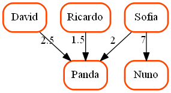
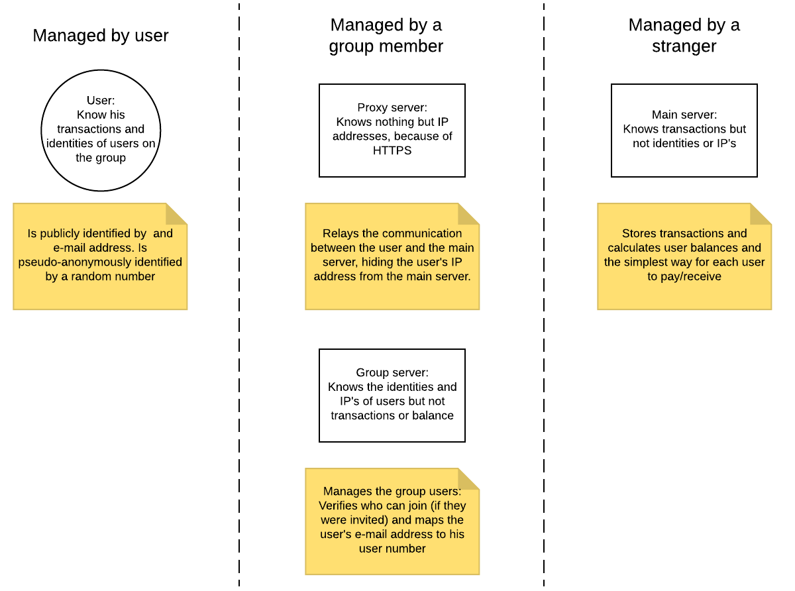

# Group Bank

### A Warning
**Take all of our security claims with a big grain of salt. We're not experienced cryptographers, we're students and this was made for a cryptography course. If you want to be sure that your data is safe, please don't use this as it's not even remotely tried and tested and we are not experienced in security.**

With that out of the way...

### What is Group Bank solving
Ever been caught in a debt triangle? You know: Mike owes you 20€ for dinner last night, but he’s waiting for Anna to pay him for back for pizza last weekend, and she is waiting for you to pay her back for those movie tickets… Sounds familiar?

In the end, it is possible that nobody owes anyone anything or that everything can be settled with just one transaction. Figuring this out is a pain the neck - it takes effort and time, and worst of all: involves math (shivers). Shiver no more, because this is a thing of the past. With GroupBank you will never have to think about this problem anymore.

You can create a group in Group Bank with a bunch of your friends and you can start issuing loans to each other. Group Bank keeps track of all the loans and gives you the most efficient way (in number of transactions) of settling your debt within the group.

Essentially, turning the mess on the left (and it is a very small example) into a manageable thing, on the right:
  

### Ok, how? I don't want my transactions out in the open
The system relies on a fundamental idea: The identities of the users should be decoupled from the transaction history, such that any one server knows, at most, just one of them. If the server managers don't collude with each other (we'll explain later why this would be unlikely), your transaction data is safe. 

This decoupling is done by assigning random numbers to users, as identifiers. The server storing the transactions and making calculations only sees these random numbers, so it has no idea who it is. If someone leaks a user's identity to the this server (we call it the _main server_) the server will be able to know all your transactions, but your transactions are still hidden from everyone else (unless the _main server_ leaks it's database).

The users in a group should still be able to identify each other, of course. This is done via what we call the _group server_.
This server keeps track of who is associated with each random number, so that when the _main server_ says "settle your debt by paying 5€ to #9619827364912", the application can show you "settle your debt by paying 5€ to Alice"

Here's a diagram of the architecture:

You probably noticed a third server, the _proxy server_. It will most likely run on the same machine as the _group server_, all it has to do is mask the IP address of users that want to talk to the _main server_, by relaying their communication. It can't read/modify anything because the communication is encrypted with HTTPS

As you can see on the diagram, the _main server_ should be managed by a stranger, since group members know everyone's identity. Imagine it is a public service, like GitHub. If it's large enough it won't risk it's reputation by colluding with someone only to get a single group's information (and probably won't even care enough about a single group anyway)

### How a group works
Assume the _main server_ is a public service that is always running.

Setting up a new group involves these steps:

1. One person sets up a new group server and proxy server
1. He creates the owner user (a user without a signed invitation)
1. He invites users to the group through the group server
1. Invited users get an e-mail with a link to the client software, the group id and a secret code
1. Invited users open the client software, input the group id and secret code and join the group
1. Each user can now invite other users as well. 

Invitations are signed and stored on the group server, creating a hierarchy of responsability. This is to avoid a user, Bob, creating a fake user, Dave, that owes him money, which would simplify Dave paying whatever Bob owes. But Dave isn't a real person, so he won't be paying anyone. Well, Bob invited him, so he's responsible for contacting him or he'll be paying what Dave owes.
If a user has no invitation (such as the owner), the responsability falls on the group server owner.

### About non-repudiation
An important question to have is "Can a user claim the server forged something in his name?"
A user that owed money might feel inclined to claim that a transaction was forged and that he doesn't owe it.
Sure, since it's probably a group of friends this is unlikely, but the system should still prevent such claims.

So what prevents a user from doing it?

Remember those random numbers that identify users? They're actually 2048bit RSA public keys. RSA is a type of [asymmetric cryptography](asymmetric cryptography) that is widely used. The user holds the private key and this means users can digitally sign messages. Since only they hold the private keys the signatures prove they were the ones that created a certaing message (like asking the server to record a new loan to another user).

The servers themselves also have RSA keys, so that the servers also cannot repudiate certain messages (like proving a user was accepted into the group, in case the group server owner decides to delete the user from it's records because he owes him a lot of money)

In short, every entity involved in the system will hold RSA keys and signatures are used in pretty much every action.

### This seems way too hard to use...

### How complete is it? Are you planning on improving it?

### Check out our wiki for more:
- What we are trying to do
- How our protocol works and why made certain decisions
- What we used to implement it and why
- How to set up the servers and what security concerns you should have if you manage them
- Our Internal API, i.e. the formal description of how the client interacts with the servers
- Planned improvements and ideas
